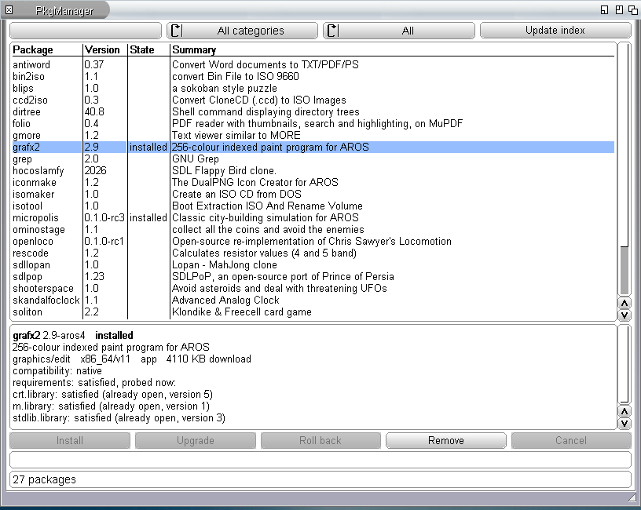
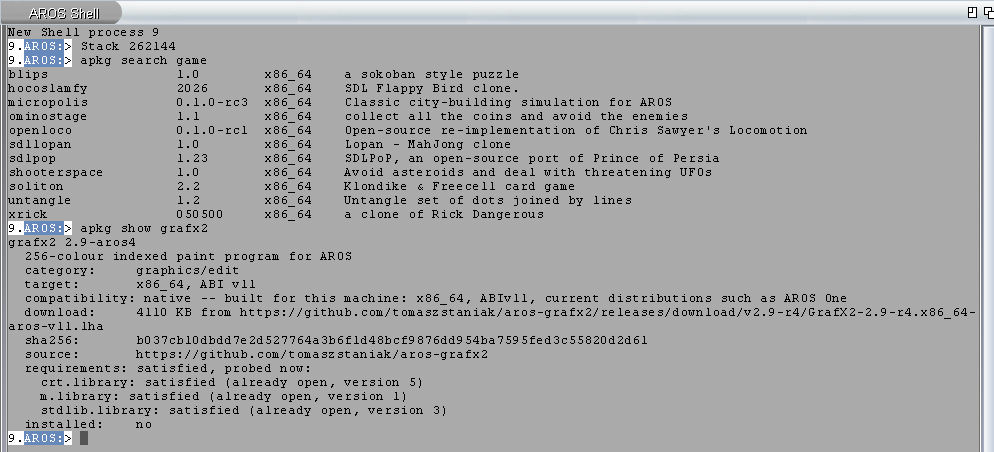
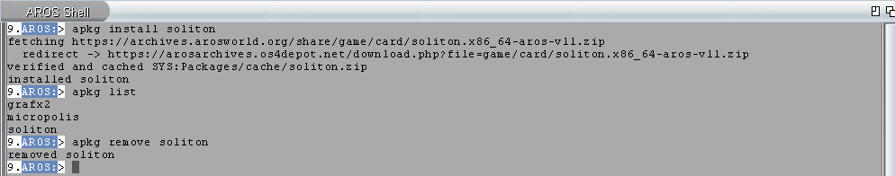

# arospkg

Find, install and remove AROS software from a window or the Shell.
**PkgManager** is the graphical interface; **apkg** is the command-line tool.
Both use the same catalogue and installed packages.

**[Download 0.4.0 for AROS (x86_64, ABIv11)](https://github.com/tomaszstaniak/arospkg/releases/download/v0.4.0/arospkg-0.4.0.x86_64-aros-v11.zip)**
· [Release notes](https://github.com/tomaszstaniak/arospkg/releases/tag/v0.4.0)
· [i386 ABIv0](https://github.com/tomaszstaniak/arospkg/releases/download/v0.4.0/arospkg-0.4.0.i386-aros-v0.zip)
· [Raspberry Pi](https://github.com/tomaszstaniak/arospkg/releases/download/v0.4.0/arospkg-0.4.0.aarch64-aros-raspi.zip)
· [Other builds (0.3.1, experimental)](https://github.com/tomaszstaniak/arospkg/releases/tag/v0.3.1)

New in 0.4.0: open installed folders, read package setup notes, update apkg
itself and use larger catalogues. Tested with 5,000 package entries.

## Install

1. Download the ZIP for **x86_64 ABIv11**. If upgrading, close PkgManager
   and wait for any apkg operation to finish.
2. Open a Shell and use `CD` to enter the drawer containing the ZIP.
3. Run these commands to unpack it, put `apkg` on the command path and
   fetch the software catalogue:

```text
UnZip arospkg-0.4.0.x86_64-aros-v11.zip
CD arospkg-0.4.0.x86_64-aros-v11
Copy apkg C:
apkg --version
apkg update
```

`apkg --version` should report **0.4.0** and `abi v11`.
No compiler, Installer script or separate TLS libraries are needed.

Keep the extracted drawer somewhere permanent, not `RAM:`, if using
PkgManager (included in the ABIv11 archive). Installing packages requires
a working network connection.

**Upgrading from 0.3.x?** Install 0.4.0 manually using the commands above.
Keep `SYS:Packages`; it contains your installed programs and package records.

## Use the graphical interface

From the extracted arospkg drawer, start:

```text
Run PkgManager
```

Click **Update index** to refresh the catalogue, select an application,
read its requirements and click **Install**. To uninstall it later, select
it and click **Remove**.

Select an installed package and click **Open folder**, then launch the
program inside. The default location is `SYS:Packages/<id>/`.



## Use the Shell

For example, find and install the Soliton card game:

```text
apkg search soliton
apkg show soliton
apkg install soliton
```

`show` displays the description, compatibility and requirements before
you download anything. After installation apkg prints where the program
is and the command that opens its drawer in Wanderer:

```text
apkg open soliton
```

| Command | What it does |
|---|---|
| `apkg update` | Refresh the available-software catalogue; does not upgrade installed programs. |
| `apkg search` | List available packages. Add a word to search. |
| `apkg list` | List installed packages. |
| `apkg verify soliton` | Check installed files against the package record. |
| `apkg remove soliton` | Remove the package, keeping locally changed files and files it did not install. |
| `apkg upgrade soliton` | Install a newer revision of the same upstream version, when available. |
| `apkg rollback soliton` | Return to the previous revision, if its archive is still cached. |
| `apkg open soliton` | Open the package's drawer in Wanderer. |
| `apkg self-update` | Replace this apkg with the latest stable release; `--check` only reports. |

From 0.4.0, use `apkg self-update --check` to check for a newer stable
release and `apkg self-update` to install it. The previous executable is
kept as `apkg.old`. Update PkgManager separately from the release archive.

Both interfaces use `SYS:Packages` by default. For another location, pass
the **same root to both**, every time:

```text
apkg --root Work:Packages update
apkg --root Work:Packages install soliton
Run PkgManager --root Work:Packages
```

This selects a separate package root; it does not move existing installs.

Use `apkg --help` for common commands and `apkg --help-all` for the full
list. `apkg --about` shows project and licence information; PkgManager has
an **About** button.

### If a download fails

Check that the system has a working network connection and that
`ENV:SYS/Certificates/ca-bundle.crt` exists. Certificate checks are
required; do not disable them.
If `show` reports a CPU or ABI mismatch, choose a build for your system.

## What it looks like



Installing and removing a package from AROS Archives:



PkgManager does the same from a window, and shows the plan of an upgrade
or a rollback before it runs. The screenshots are from AROS One 1.3 under
QEMU, with the published catalogue.

## Documentation

Start at [`docs/README.md`](docs/README.md):

- [using arospkg](docs/guide/using.md): install, open, update, remove,
  in one page;
- [publishing your program](docs/guide/authoring.md): describe, check,
  pack and submit with `apkg-pack`;
- [packaging guide](docs/guide/packaging.md): from a program's drawer to an
  approved index entry, tested on AROS;
- [metadata reference](docs/guide/metadata.md): every field, and who
  checks it;
- RFCs for an [embedded package manifest](docs/rfc/0001-package-format.md)
  and an [application folder format](docs/rfc/0002-application-folder.md),
  both proposals;
- [ARexx interface](docs/arexx.md);
- [release notes](https://github.com/tomaszstaniak/arospkg/releases)
  for changes and known limitations.

## Layout

- `src/`: `libpkg/` (all the logic), `pkg/` (`apkg`), `pkgmanager/`
  (`PkgManager`).
- `tools/`: host scripts that import the AROS Archives catalogue, check
  archives and generate the index.
- `index/`: candidates imported from the catalogue and not yet reviewed.
  Approved manifests and the index are in arospkg-index.
- `tests/`: host unit tests, the scripts run on AROS, and pinned fixtures.
- `examples/arexx/`: ARexx scripts for PkgManager.
- `release/`: the README and licences shipped in the release archive.

## Building

You need an x86_64 AROS cross toolchain for ABIv11 (GCC 10.5 was used) and
the matching SDK with `libz.static.a`. The default build uses vendored
Mbed TLS 3.6.7 and jitterentropy 3.7.0. `TLS=openssl` selects an alternative
backend; the 0.4.0 release uses Mbed TLS.

```
TC=/path/to/toolchain SDK=/path/to/sdk sh src/build.sh       # apkg
TC=/path/to/toolchain SDK=/path/to/sdk sh src/build-gui.sh   # PkgManager
```

`src/build-mainline.sh`, `src/build-i386.sh`, `src/build-aarch64.sh`
(hosted) and `src/build-raspi.sh` (native Raspberry Pi) build other targets
with their matching SDKs and toolchains. Mainline and the Pi build
use system `getentropy()`. Check the release notes for each target's
test coverage.

The 0.4.0 archive was made from the release commit with
`README=release/README TARGETS=x86_64-aros-v11 sh tools/make-rc.sh 0.4.0`.
Despite its name, this script packages stable releases too; without
`TARGETS` it builds all four targets and needs all four toolchains.
`tools/make-release.sh` is the older packaging path, not the release recipe.

`tests/run-host-tests.sh` runs the unit tests on the host: ZIP, LHA,
SHA-256, the upgrade planner, the ARexx parser, the index generator and the
documentation examples. It needs a C compiler, Python 3 and `lha` (lhasa).

The tests on AROS (`tests/*.script`, `tests/arexx/`, `tests/show/`) run on
AROS One under QEMU. The shell scripts that drive them were written for our
own test machines and will need adapting elsewhere. Test coverage is
summarised in the release notes. Historical run records remain available
in earlier Git revisions; local reports and work notes are not part of
the current public tree.

## Licence

MIT, see [`LICENSE`](LICENSE). The archives include the licences for
Mbed TLS, jitterentropy (except mainline), zlib and the AROS XTerm
terminal-control client.
